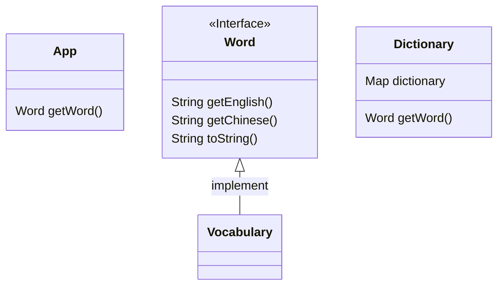

# j.p.dict

## Class diagram

```mermaid
classDiagram
class App {
    Word getWord()
}

class Word {
    <<Interface>>
     
    String getEnglish()

    String getChinese()

    String toString()
}
class Dictionary {
    Map dictionary
    Word getWord()
}

Word <|-- Vocabulary: implement
```

## Dictionary - data source
[dictionary api](https://www.free-api.com/doc/517)

